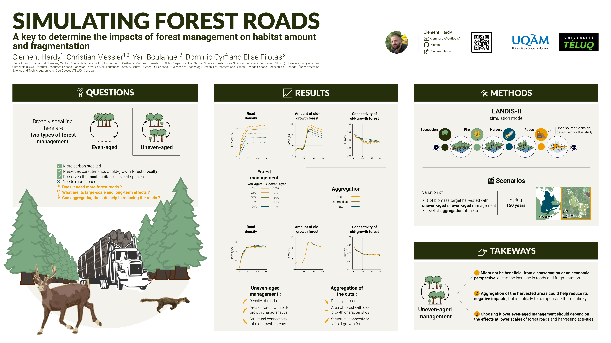

Uneven-aged forest management is perceived as offering attractive trade-offs between wood production, and other important ecosystem services. But uncertainties persist about its impacts, due to the distribution of harvesting areas and the construction of forest roads over larger areas than the most traditional even-aged development. We have been exploring these impacts on the composition and fragmentation of a landscape for more than a century.

For this, we used the spatially explicit LANDIS-II simulation model and a new extension that simulates the evolution of the forest road network. We simulated 30 development scenarios in a landscape of the Mauricie region by varying the use of uneven-aged management methods and the aggregation of cuts. Our results show that, in comparison with even-aged management management, uneven-aged management increases the density and operational costs of the forest road network, the amount of forest with old tree cohorts, and the per se fragmentation of these forests. In addition, in the boreal forest to the north of the landscape, forest fires tended to fragment old forests despite forest management, reducing the differences between management strategies.

We conclude that the choice of uneven-aged management must depend on the type of fragmentation and habitat considered, the patterns of fragmentation related to natural disturbances, and the perceived effects of per se fragmentation in the landscape. We also conclude that aggregation of cuts can reduce the negative impacts of uneven-aged management, but is unlikely to fully compensate for them.
