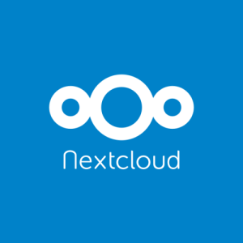

As human knowledge accumulates and our daily lives become ever more busy, it's not wonder that we start feeling overwelmed as researchers.

Our human brain might be an amazing tool to discover and understand the world around us when compared to a cat's or a dog's equivalent, but it is still both biased and limited.

Luckily, there exist many different tools that can help us to compensate for these issues. And the wonderful news is that they are ***free***, that they do not contain advertising, and that they do not sell information about yourself or your data.

Here is a list of 3 open-source software that changed my life as a PhD student and early researcher, by allowing me to **organize my references, my notes and my files** like never before.

# Joplin

**Joplin is a note-taking application with many features.**

It is an open-source and completely free software that allows you to create notes in the "Markdown" writing language, and to organize them in "notebooks", and associate them with tags. **It is an excellent alternative to software such as Evernote or Microsoft One Note**.

In particular, Joplin allows you to:

- **Gather all your written or graphic information in one place**: your class notes, your thoughts, your projects, your recipes, your shopping lists, your to-do lists, etc.
- **Find all this information very quickly** (in a few seconds) thanks to the search tools.
- **Use it on any computer** (Windows, Mac, Linux) and **on any phone** (android, IOs).
- **Synchronize your data on the cloud you choose** : Nextcloud (see below), Google Drive, One Drive, etc. So you can have all your data written everywhere, all the time, on any media.
- **Have a fully customizable interface** that allows you to focus totally on what you are writing, so that you don't waste time and attention.
- **Export your notes in many ways**, with a format (markdown) that can be read anywhere and at any time.
- **Automatically manage the images and files you insert in your notes**.
- **Automatically edit your notes** (so you can go back at any time if you made a mistake).
- And much more.

Joplin is an amazing software to try your hand at note-taking tools, and maybe even at the [Zettelkasten](https://en.wikipedia.org/wiki/Zettelkasten) method !

Other wondful alternatives include [Zettlr](https://www.zettlr.com/), or [Obsidian](https://obsidian.md/). However, I think that Joplin is the best place to start if you're not used to such apps.

To download Joplin, take a look at [its website](https://joplinapp.org/) !

# Zotero

**Zotero is a bibliography management software.**

Having complete and rigorous bibliography information is necessary in academic documents (thesis, dissertation, article). It can also be very important for blog or website posts, videos, scripts, and many others. It can additionally be very useful for managing personal resources. The bibliography information of a document is called 'meta-data', i.e. data *about the document*, but *outside the document* (its title, its publication date, its author(s), etc.).

Zotero allows you to :

- **Easily save all the metadata associated with a document** (title, authors, place of publication, date, URL, etc.).
- **Associate notes or tags** to each reference or document.
- **Sort these references by category**s, or by their characteristics to find them easily.
- **Download associated PDF files** when possible.
- **Export bibliography files** that contain all the details of the references, so that they can be inserted into a document.
- **Insert and manage the bibliography of a document** in Microsoft Word, Libreoffice or Google Doc using its plugins.

Zotero have a wonderful community that devellops incredible plugins such as Better BibTex, Zotfile or MDnotes. All of these will allow you to connect your Zotero database to other software such as Joplin, Zettlr and Obsidian, or to export the annotations that you make in your `.pdf` files.

To download Zotero, you can go on [its website](https://www.zotero.org/).

# Nextcloud

**Nextcloud is a cloud software like Google Drive, allowing to host files, but also containing multiple very useful applications. However, unlike Google Drive, it is open-source and free**. You only need to host it on a server yourself, or choose an host (free, or subscription-based).

Nextcloud allows you to:

- **Have an online file storage space that is totally yours**.
- **Have access to lots of different applications all open-source** that allow you to manage to-do lists, *kanban boards*, calendars, contacts, notes, recipes, maps, track your phone's location, collaborate on documents, and much more.

Nextcloud is an incredible way to boost your productivity by organizing simply across devices, and I cannot recommand it enough. It is also perfect to host your Joplin notes in the cloud, or your Zettlr or Obsidian files. You can even save the `.pdf` files of your zotero database with it ! Best of all, most of Nextcloud's apps can synchronize very easily with your phone. Tasks on your phone ? Check. Calendar ? Check. Kanban boards ? Check. Recipes ? Check. The list goes on.

To find an host or download nextcloud and host it yourself, you should look at [the project's website](https://nextcloud.com/).

# Remember to contribute !

All of these incredible programs are free, but they all represent hours and hours of hard work, along with the work of creating documentation, beautiful websites, and easy-to-use installer for people like you or me.

Using open-source software can be describe as a particular way of life, as these are often much more respectful of your privacy than software made by companies such as Microsoft, Google, Facebook, or even Macintosh. But the price to pay is often on the shoulder of the devellopers : they are the ones investing the work needed, and will often have nothing for themselves if the venture fails, with no add revenues or revenues from selling your data.

Hence, **if you start using one of these programs, remember to take the time to make a donation or a contribution to the project that they represent**. If the software pleases you, the team behind it have certainly earned it.

# Want to know more ?

If you want to learn more about these software, how to use them and their functionalities, you should take a look at the [free online workshop](https://klemet.github.io/Workshop-Organization-EN/) that I've created to help you discover them.

With just an afternoon before you, you'll learn the most important thing about them; but you'll also learn some great methods to use them properly, and even in tandem together !