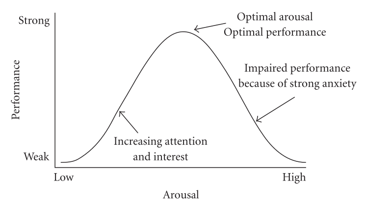

Here I was, a lowly tarnished in search of the legendary Elden Ring. Against me was the strength and cunning of a whole fantasy world that wanted me dead, dead, and dead again. Every enemy, encounter and trap carefully planned and placed to crush me and my foolish ambitions by video-game designers half a world away. Armed with my sword, I launched myself at a huge armored knight towering before me - one of the many, many "bosses" of the game blocking my path to the Elden Ring. I had beaten many video-games before this one, and fought many knights taller than me a great number of times. I was confident that this time would not be different.

But the knight barely flinched at my blade, and retaliated before I could even finish my strike. Hurt, I rolled away, trying to escape his sword for one moment. With some distance between us, I quickly took out the magical flask that would heal me. But the knight knew better; and while I was drinking, he impaled me with his sword. Dead. But as my character had the strange curse of not being able to die, I tried again. And died again. And tried again. And died again. And again. And again. And again.

I put my controller on the table, frustrated at the game; but even more frustrated at me. Here I was, a boy living in one of the most comfortable places on earth, wasting my time in frustration at a video-game. Yet, my affection for games is not always unjustified : I love games because many of them taught me very valuable lessons. They also gave me calm and relaxation when I needed them, along with some great fun with my friends. The truth was that I just didn't understood the lesson that Elden Ring had to teach me at this time; and what a lesson it was, indeed !

## The most difficult games

Elden Ring is not any game. It has been a huge success since its release, with million of players enjoying its enormous and detailed world of decaying fantasy. An important part of its renown comes from its pedigree, as it's the last creation of Fromsoft - a studio well known for its dark, difficult, but ultimately very rewarding games. In particular, the *Dark Souls* series that preceded Elden Ring was celebrated and almost universally known among gamers. It was also known as some of the most difficult games ever made. But many would say that this difficulty aspect was really overplayed; that it was not that difficult, but that it simply asked the player to be cautious and engaged with its world.

I've never been a huge fan of the *Dark Souls* series, as I always found it too frustrating. In my student life, I often played games to relax and unwind; not to be repeatedly killed by traps, rats, dogs, humans, monsters, statues, cliffs, and many others colorful things that *Dark Souls* can offer. Still, I've always pondered the possibility that there was something in those games that I couldn't see, and that gave so many over players joy and satisfaction. And with Elden Ring, I think that I finally found what this was.

Indeed, playing Elden Ring made me re-think many of my habits as a player; and in particular, my relation to the famous *Game over* screen. In *Dark Souls* or in Elden Ring, this screen simply says *You died*; and as a player, it's easy to take it as a sign that you did something wrong. That you should feel bad, and that this feeling of failure is a part of what will ultimately push you to better protect your character next time, and win. I think that most gamers would agree that that's how a *Game over* screen feels in most games; it's a small punishment, but a punishment all the same. A just punishment. The same one that happens when the opposite team scores a goal in your soccer match : you just want to avoid it more afterward, and it's really a part of the funs in many ways.

But in Elden Ring, I've found that seeing this *Game over* screen as a sign of failure doomed me to get into a circle of frustration. The more I died, the more I got excited to win; but then, I started to get stressed; and then, frustrated; and all the time, I would become worse and worse in the fight. I would die to the knight more and more quickly, sometimes without even being able to hit him once. And here was the lesson : the *Game over* was a failure, but not the one that I imagined. It was a lesson more than a failure, and one that connected to an awesome bit of psychology : the Yerkes-Dodson law.

## You died | You learned

The Yerkes-Dodson law is absolutely fascinating, especially when you take into account its "zone of delusion". Basically, the law describes a possible relationship between pressure and performance at different tasks in humans. Interestingly, it can be shown as a bell-shaped curve; what that means is that we perform better when we have a certain amount of pressure put on us. But even more interestingly, it means that as soon as the pressure gets too high, our productivity drops. This is called the *zone of delusion*, because in this zone, we can often get tricked by our emotions into thinking "*if I were a bit more stressed, I'd perform better*"; while in fact, we have already passed the optimum of the curve. Indeed, things would (according to this law) only get worse if we get more stressed or anxious about what we're doing. Despite all of this, one has to remember that the empirical evidence for this "law" [has been disputed](https://www.emerald.com/insight/content/doi/10.1108/JMP-03-2013-0085/full/html), and that other, more complex theories on the subject now exist. Still, the Yerkes-Dodson law contains some useful insights that I think are applicable in our daily lives.

I think that you can see the connection between those insights and Elden Ring : while fighting the knight, I quickly got into something resembling the zone of delusion. By putting on myself the pressure to perform, to succeed, and to avoid the *Game over* screen, I thought that I would get better; but I only got worse. Frustration made me more prone to errors; and in particular, it made me impatient (a mortal mistake in a game like Elden Ring). But when I finally saw that was happening and remembered the Yerkes-Dodson law, it all clicked : I was loosing because I saw the act of losing the fight as a great mistake. But it was not a great mistake. How could losing at a video-game designed to be hard and challenging be a great mistake ? It would be like saying that your first drawing as an artist not being as worthy as the *Mona Lisa* a great mistake. It's not even really a mistake : it's a lesson, as we can often become better only by practice. Hence, this is not a punishment, but something precious that is given to you because you tried; not something taken from you because you failed.

And so, I came back to the knight. But I came back with a changed perspective. I wasn't the guy who lost against him and wanted revenge anymore; I lost my frustration, and stopped acting with pettiness. I accepted that this difficult fight was part of the game. A wonderful game; a wonderful privilege to traverse beautiful hand-crafted lands to give myself time to learn and enjoy the world in a safe environment. I accepted that he would beat me many times again. And then, everything changed; Because now, I came to him as a student as much as an adversary. 

I took the time to avoid his attacks. I took the time to look at them. And then, I saw it : one opening. Two openings. Two small moments that I could use to touch him with my sword without being touched in return. I tried to take advantage of one. I failed. Never mind; I tried again with a smile. And I succeeded. His life bar lowered a bit. But I died, and came back again. Yet each time, the probability of him touching me got lower. Each time, I got a bit better, until I got a lot better. I had reversed the trend. I had broken the cycle. And I didn't do it through more anger, more stress or more pressure : but with more calm, more detachment, and more acceptance. I changed my position on the Yerkes-Dodson law towards an optimal spot of performance, and it showed. 

I ended up winning pretty quickly. The knight fell on his knees, disappearing softly in a myriad of sparkles. One down. Thousands to go. The rest of my life, just as in Elden Ring, would be filled with though challenges, and maybe even enemies to face. But while life would impose these onto me, the choice of my state of mind would remain partially mine. I could increase my stress, put more burden of my shoulders, and thus make myself prone to breaking the day that I would inevitably fail one of my encounters with reality. Or I could choose to see everything as a lesson, everything as a gift, and thus give me wings to soar higher than my insecurities, staying flexible and adaptive. To remember this, I will keep walking towards the Elden Ring, with the Yerkes-Dodson law (or what I understand of it) as a precious reminder of this truth.

