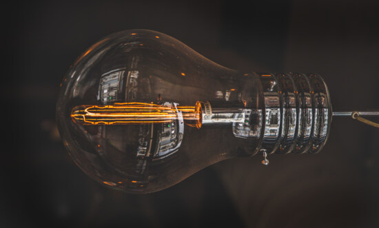

"That's a prediction, not an hypothesis" read the comment of one of my co-author. He was right : what I did present as one of the hypotheses of my research paper was, in fact, a prediction. But then, I started to notice that a majority of the articles I read seemed to do the same mistake. A couple of days ago, I read the following in a recent article in ecology (which I'm paraphrasing) :

> We hypothesize that climate warming and the increase in CO2 concentration will increase forest productivity and carbon stocks in our modeled landscape.

Which is indeed a prediction disguised as an hypothesis. It's pretty hard to see, and pretty easy to miss; but apparently, the consequences for science can be more dire than I imagined at first, when the problem was revealed to me.

## The epidemic of confusion

The prevalence of this confusion is not a new phenomenon. [In 2001, Guy R. McPherson wrote an article](https://www.jstor.org/stable/4451093) pointing to the fact that a certain amount of scientists did not know how to make the difference, which lead to this kind of error in research papers.

> Most of these discussions begin with a question I pose to PhD. students at their oral comprehensive examination: "What is a hypothesis?" When I first began asking this question more than 10 years ago, nearly all students invoked Popper's falsificationist view (e.g. Popper 1981), then proceeded to confuse hypothesis with prediction.

> Another personal anecdote reinforces the view that scientists (including those outside my academic institution) may confuse "hypothesis" and "prediction." In a recent manuscript, my co-author and I substituted the inappropriate term "hypothesis" for the appropriate term "prediction" throughout the manuscript (a total of seven times). The paper was submitted to a major international journal in 1998 and was subjected to a high level of scrutiny by three reviewers (presumably scientists who are reasonably well known), the associate editor, and the editor-in-chief (the latter two individuals are internationally renowned scientists). None of the five individuals in the review process commented on the inappropriate use of "hypothesis," and the manuscript was published in the journal in 1999 (corrections were noted by the co-authors on the page proofs, and incorporated in the published manuscript).

[McPherson, 2001](https://www.jstor.org/stable/4451093)

I do not believe that this problem is due to the fact that PhD students and researchers are not smart enough to grasp the difference; nor that it comes from a real desire to disguise one into the other. It could be due to the fact that the difference is not taught enough - or not well enough - in the university, or even before that. In fact, McPherson's article was published in *The American Biology Teacher*, and was first and foremost directed at science educators. If our teachers don't know the difference well enough, it's understandable that most student won't know it past their diplomas.

But again, I do not believe that any blame is to be given to science educators : it's simply that the difference between hypothesis and predictions can be very subtle, and that it is easy to be influenced by the work or words of others that confuse the two. Hence, we end up in a kind of [epidemic of confusion](http://datanuggets.org/wp-content/uploads/2014/01/Strode_NABT-2011-Hypothesis-Presentation.pdf).

## The real difference between hypotheses and predictions

### Predictions

When we try to explain the difference between an hypothesis and a prediction, that's where we start to see where the problem lies : it's not always that easy to distinguish the two. From my understanding, there is no single method to be assured of what we're doing, but only a set of clues. I'll try to summarize them here.

 on Flick.")

In short, we can say that a prediction is an affirmative statement about what will happen in certain conditions : they are all about patterns that can be observed. Most of all, as [McPherson (2001)](https://www.jstor.org/stable/4451093) points out, a **prediction** does not need the scientific method to be validated or invalidated (in contrast to an hypothesis). In fact, we test predictions in our daily life without using any science at all. Even fortune tellers do it. Here are a couple of examples :

- The salt is in this section of the supermarket
- The pastas are ready
- It will rain tomorrow

All of these are predictions, and only require observation - not experimentation - to be validated or not.

Where it gets trickier is when we see predictions that concern things that are not in our daily lives, but that seems to touch the realm of "science". When they do, we might think that we are looking at an hypothesis. See the following statements :

- There are no living organisms on Mars
- Climate change will reduce the resilience of forests
- An increase in protein X will lead to disease Y

I don't know about you; but I'm personally are much more inclined to identify those as hypotheses. But nothing has really changed were compared to the three statement regarding "everyday life" : we're still making affirmations about something that will happen in certain conditions, which is a prediction.

However, there's an important catch that [McPherson (2001)](https://www.jstor.org/stable/4451093) explains : that while testing predictions does not require the scientific method, it is in itself part of the scientific method, and part of what we call *science* overall. This is because sometimes, we have to just test a prediction to advance; wherever it is in order to validate or invalidate an hypothesis (that's what is required to do it, after all), or because we need more information to formulate an hypothesis, or because the answer is really needed in the current context. **Predictions are not "bad science"**; they are a tool used by science, and necessary to science. The problem lies in confusing them with hypotheses.

### Hypotheses

A good way to identify an hypothesis is to see if the statement it contains can be an answer to a ***why***. This is because hypotheses should be propositions related to how a system function, which can then be tested by using an experiment. Of course, any hypothesis should be falsifiable.

Let's take a look at a simple example : we have a flashlight that doesn't work.

- Asking "*Why doesn't the flashlight work ?*" is a good example of a research question.
  - But if we say "*Is the flashlight not working because the batteries are empty*", we're already making an implied hypothesis, since we're giving an explanation for why the system (the flashlight) works as it does. One thing at a time !
- Saying "*The flashlight doesn't work because the batteries are empty*" is a hypothesis : it answers the *why*, and can be falsified.
  - Another hypothesis can be "*The flashlight doesn't work because the light bulb is broken*".
- Now that we have the hypothesis, we can propose an experiment to test it : we can change the batteries, and see if the flashlight will work.
- Finally, we can make a prediction that will come true if the hypothesis is validated : "*The flashlight will light up when we change the batteries*".

Another important thing, according to [McPherson (2001)](https://www.jstor.org/stable/4451093), is to distinguish the hypothesis (a statement about how the system functions) with the *statistical* hypothesis (which is really a prediction : a statement about the statistical pattern that we should observe *if* the hypothesis is true).

So if we come back to the first example that I gave of a prediction hiding as an hypothesis, the real hypothesis would be :

> We hypothesize that climate warming and CO2 concentration affects forest productivity and carbon stocks at the landscape scale.

One way to test this hypothesis is to make a modeling experiment : ***if*** we model a forest landscape with increasing climate warming and C02 concentration, ***then*** we should see the productivity and carbon stocks increase.

But the article is recent, and the idea that climate warming will increase forest productivity in some forests in some ways is already well known; it's safe to say that this is not the hypothesis that the authors wanted to test. But because it is not formulated in the right way, it's hard to know what kind of information we will get in the end. And that's one of the risks associated with making this confusion.

As a summary, a good way to identify an hypothesis (from my own point of view) is to see if it fits in the following sentence :

> ***If*** `experiment`, ***then*** `prediction` ***because*** `hypothesis`.

## Why is it so important to distinguish the two ?

Confusing hypotheses and predictions can be more problematic that we might think.

A first problem is that by doing so, we can **give wrong impression about what the scientific method is to the public**, and especially to students and young people. If we present the act of making a prediction and testing it with an observation as science, then many things that we do in our daily lives is *science*. Checking if the salt is in this sections of the supermarket is a good example : it's as much science as saying "putting batteries into the flashlight will make it work". It is *part* of the scientific method, but it's not enough. Making a prediction and validating it doesn't offer a lot of information in itself; especially if we didn't take the time to design them so as to answer the real hypothesis as best we can.

A second problem is that when researchers do this confusion, they show that they do not completely grasp the scientific method. **This might be a contributing factor to the many problems that science is facing today** : the bias of publication towards studies that "validate hypotheses" or predictions; the fact that confounding factors are not taken into account while designing the experiment or observation made in the study; the lack of replicability ; the difficulty of synthesizing many studies that concern a particular topic; the misinterpretation of statistical analysis; and so on.

A third problem is that it prevents us from **recognizing research that is done without testing an hypothesis**. As [McPherson (2001)](https://www.jstor.org/stable/4451093) states, most research in biology describes patterns rather than testing the mechanisms underlying of the patterns : and that's OK. Not all research articles need to have an hypothesis, as a big part of formulating hypotheses and putting the scientific method to work is investigating patterns. For example, one would not test the hypothesis "tobacco causes lung cancer" without a previous investigation of the prevalence of lung cancers in tobacco smokers. Such an investigation would be part of *science* as a whole, but would not be testing any hypothesis : only observing patterns, or testing predictions. Maybe we should appreciate that better, and understand that *science* is not just using the scientific method : *science* is a also a big adventure of communication, funding, coordination, techniques and methods, relations, journals, and even policy.

I believe that's why it's important to distinguish hypothesis from predictions; because it takes us away, as researchers, from the desire to fit the routine of "introduction, hypothesis, methods, results...", and embrace the fact that *science* is a more complex affair that require adaptability and innovation. But more simply, it's important to come back to the roots of our profession, and take the time to understand the basic concepts that we might sometimes forget and brush away. If you took the time to read this article - and if I made a good job writing it -, then we're hopefully already part of the solution.