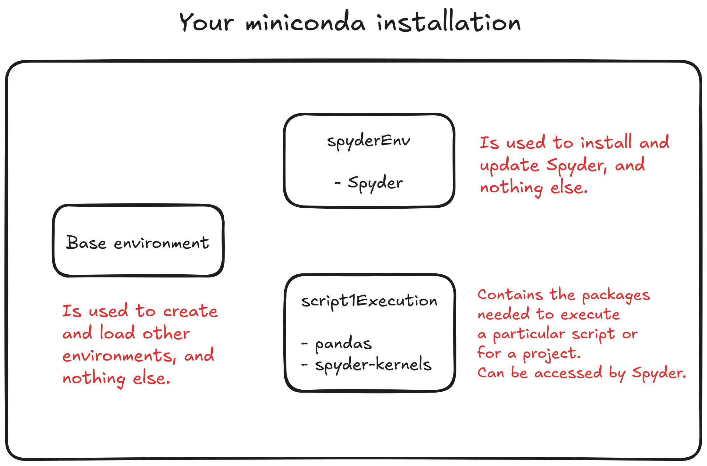

> *This article was not written using AI. It's a text I wrote to help other students in my lab learn to use Python, as most people in ecology are rather used to R.*

Python is a wonderful programming language : it's fast, it's quite easy to read and write, it has a lot of awesome packages for scientific purposes, and it's a very mature language with a lot of users. [In fact, it has consistently ranked as the most popular programming language in the world since 2019, and has only increased its advance from other languages since then](https://youtu.be/ZTPrbAKmcdo). It is now used for GIS, AI models training and usage, mathematics, software, statistics, and many other things. Python also has a great system of interactive notebooks (like R Markdown) called “[Jupyter Notebooks](https://jupyter.org/)” which is really powerful and has a ton of features; these notebooks are great to document your research as you do things. I use them a lot in my work.

Additionally, like R, Python is an interpreted language : it can be used in a terminal. You send lines, and the terminal responds, like R. But you can also do scripts or entire programs with it.

## Why do I need to be careful about how I install and use Python on my computer ?

However, Python differs from R in how it manages its "packages" that can be installed to add new functions, like in R. R was purpose-built for statistics, while Python is a general-purpose language with many uses, which causes complexity. One of the issues is that package management in python is more complex, with packages often requiring other packages of a specific version as dependencies (e.g. package A requires package B with version 2.1 to function). These version requirements can easily lead to "conflicts" between packages, causing errors and other problems. In addition, while R has a single package manager (you use it when you use install.package in R), Python has several package managers that were developed through time (particularly `pip` - the default manager - and `conda`, a more complex manager which can deal with dependencies other than in the Python language).

**What that means in practice is that you can easily fall into one of three problems when using Python on your computer without knowing what you're doing :**
  
- 🐍❓🐍 Ending up with several Python installations on your computer (e.g. one from the regular installer at python.org; Anaconda or Miniconda; etc.) and not knowing how to access the one you want (because calling the command "python" in a terminal will use one of your Python installation based on several factors, including the PATH variables you have).

- 📦📦📦 Installing too many packages inside one installation or one environment (the most common beginner mistake, I did it myself !), resulting in a "bloated" environment in which adding new packages is very slow and complex, and where conflicts are more frequent.

- 📦⚡📦 Installing packages in an environment with different package managers, which often “breaks” the environment by creating conflicts between packages.

## The solution : learning to use a single package manager and virtual environments
  
Luckily, there are 3 easy solutions to these problem which we can take care together at once by using the right environment and package manager :
  
1. Try to have one Python installation on your computer that can easily create virtual environments (I recommend the Miniconda Python distribution for this)

2. Use only one package manager to install packages in new environments (I recommend conda or mamba, which can be used in Miniconda)

3. Create a new virtual environment for each of your projects (which is very easy to do with Miniconda/mamba).

In short : I recommend you install and use either Anaconda or Miniconda. Both are Python "distributions", meaning they install Python on your computer along with a package manager and a system to create new virtual environments easily. They also can integrate your python installation easily with the rest of your computer. Anaconda and Miniconda are both made by the same company, and are free to download and use. The difference between the two is that Anaconda comes with a lot of scientific python packages pre-installed, while miniconda is a much smaller installation with almost no packages pre-installed (requiring you to install the packages you need after installing it). Anaconda takes a lot of space, and contains a lot of packages you will probably never use; as such, I recommend you go with miniconda. Plus, miniconda is a very cute name 🐍🌸.

So here, I'm going to show you 1. How to install miniconda on your computer, 2. how to easily create virtual environments for your projects, and 3. how to install Spyder (the equivalent of R studio for Python) in a virtual environment and connect it to other virtual environments (it's done in one click).

## Installing Python on your computer

Before we start : **if you can, remove any existing Python installation on your computer if you don't have a good reason to use it anymore**. This should make things easier in the long run. With miniconda, you should be able to do everything you need in Python - for science or for programming. To find existing installations, run `where python` in a command prompt on Windows, or its equivalent in macOS or Linux. Then, try to find if it can be uninstalled. Warning : modern versions of Windows often come by default with a python.exe located in `AppData\Local\Microsoft\WindowsApps`. You can just leave this one alone.

Then, install miniconda : head to [https://repo.anaconda.com/miniconda/Miniconda3-latest-Windows-x86\_64.exe](https://repo.anaconda.com/miniconda/Miniconda3-latest-Windows-x86_64.exe) . Run the installer. I recommend you select all of the default parameters during the installation (for example, leave “add Anaconda to PATH” disabled).

Once installed, run the command `conda init` in a terminal if you are in Linux or macOS, or in a "Anaconda Powershell" or “Anaconda command prompt” on Windows (for which you should have a new shortcut in your start menu after installing miniconda; both powershell or command prompt are OK to use, as the result will be the same). 

> **💡 Why does Windows has a “Anaconda Powershell” or “Anaconda command prompt” ? What does that mean ?**  
> This is because of the ways that the initialization of shells/terminals work on these different OS. On Linux and MacOS, Miniconda can simply modify the shell configuration files to make the conda commands available. On Windows, for several reasons, it doesn’t do that out of the box. That’s why installing Miniconda also creates these “Anaconda” terminals so that you can use them to run conda commands. conda init can then change some files on windows so that you don’t have to keep using these special Anaconda Powershell/Anaconda command prompt, and can instead run conda commands from any powershell or command prompts.

> **💡 What’s the difference between the powershell and the command prompt on Windows ?**  
> These are two different “shells”, meaning interpreters of commands to interact with your system that you can interact with in a terminal. Powershell is more recent and modern; the command prompt is older. They don’t use the same syntax for the commands. I recommend you use Powershell if you don’t know which one to use.

Once this is done, you should be able to call `conda` commands from any terminal on your computer. This will allow us to easily create, activate and use virtual environments, which we will now take a look at.

> ⚠ **`conda init` might not work properly if you have accents or special characters in your Windows profile name**. In general, accents in a windows profile name cause a lot of problems. If that’s the case, take a look at the result of the conda init command to see where it has created the .ps1 file, and put it where it should be (with the right name for your profile).

## Creating virtual environments with ease

Miniconda (and Anaconda) function with what is called “environments”; each environment is a separate and isolated Python installation that contains specific packages. These are great to avoid the problems we have highlighted above (package conflicts, etc.), but also to keep your research tidy and replicable ! 

  
When Miniconda was installed, it created a “base” environment. This environment will always exist, and is the one that is loaded by default. If you start using `conda` commands in a terminal, or if you use the `python` command to run a Python console or a script, you’re most likely going to run it in the base environment.

  
**The classic rooky mistake is to use the base environment for everything**. Many people simply keep installing every package they need for everything they want to do with Python (running scripts, etc.) in the base environment. But if you do this, you quickly reach a point where adding new packages can literally take hours (as the conda package manager tries to solve the dependencies between each of your packages, which increasingly become very complex as you add more and more packages), and often result in conflicts. When this happens, you end up losing a lot of time and having to reset your base environment in some way.

  
**The rule is : don’t use your base environment for anything other than updating `conda` or for creating and loading other environments**. This is the best and most recommended use for it. Instead, we are going to create new virtual environments for each of your projects, or for each of your needs.

  
To make a metaphor : imagine that each virtual environment you will create is like a room in a house. Each of them has different furniture according to their goal (living room, bedroom, bathroom, etc.) The base environment should be the corridor to enter the different rooms in the house. It would be a huge mistake to try and cram all of the different furniture of your house in this corridor, or even in a single room ! So we will keep the rooms separated.

> **💡 But if I create a lot of virtual environments for each of my projects, isn’t it going to use a lot of space on my computer ?**  
> No, it won’t ! Conda is a smart environment and package manager : it avoids downloading a package twice between two environments that will use it. So when you create a new environment, you don’t create another copy of packages you are using in other environments, and you don’t use more space compared to downloading all of your packages in a single environment.

Now, to create a new conda virtual environment : use the command `conda create -n NAME -c conda-forge`. 

In this command, `NAME` the name of your environment (could be named after a project, or a thing you do with it : e.g. "analysisProject1", etc.). Meanwhile, `-c conda-forge` is used so that when we will try to add packages to this environment, we will use the `conda-forge` channel, which is a huge repository with many packages for Python (and one of the most used). This is where conda will look for packages when we will ask it to install packages in our environment. Other channels can be added; but `conda-forge` should contain everything you need.
  
> 💡 When you run conda create for the first time, it will ask you to accept some terms and conditions for the repositories of anaconda. As an individual researcher or students, you should be OK accepting them. Basically, the company behind Anaconda hosts and maintains the repositories like `conda-forge`, and demands money to for-profit organisations of more than 200 persons - or the IPs adresses can be blocked. See [this reddit thread](https://www.reddit.com/r/bioinformatics/comments/1emekxo/anaconda_licensing_terms_and_reproducible_science/) for an example, or [here](https://www.anaconda.com/blog/update-on-anacondas-terms-of-service-for-academia-and-research) for the details. You can also look for alternative package managers like [Miniforge](https://github.com/conda-forge/miniforge).

  
And that’s it ! Your virtual environment is now created. It will be empty, meaning that it will have no packages. To interact with this new environment, we have to “activate” it in the terminal you are using to run commands (e.g. Powershell). Once an environment is “activated”, every conda or python command you will use in the terminal will be done inside this environment. As such, conda commands will install or remove packages in this virtual environment; while python commands will run python consoles or scripts inside the environment. The terminals or scripts will have access to all of the packages installed in this virtual environment. To activate the environment, use conda activate NAME. You will see the name of the environment from now on at the beginning of your next line in the terminal.

> ⚠ Still having accents or special characters in your Windows profile name ? That’s again going to cause issues when conda will load the environment. To solve this, run the command `conda env config vars set PYTHONUTF8=1` .This will make sure that `conda` and `python` reads accented characters properly from now on.
  
To add packages in the environment, simply use `conda install` followed by the name of each of the packages you want. For example, if we want to install `numpy`, `pandas`, `rasterio` and `tqdm`, we will run : `conda install numpy pandas rasterio tqdm`.

## Finishing up : installing Spyder and using environments from now on.

To finish setting up your Python installation, we’re going to install Spyder. **Spyder is the equivalent of Rstudio for Python** : it’s an Integrated development environment (IDE) made to write code or scripts in Python easily. The interface is very similar to R studio : you have a place where you write code, a console in which you can run part of the code and see what happens, and other panels showing the variables present in your current python console, etc. It’s a must have for a Python user in science !

  
There are many ways to install Spyder on your computer. Here, we’re going to do it from miniconda, because Spyder is a python package (which, when it is installed, will appear as a program on your computer). So, we are going to create a virtual environment just to install Spyder in it (like we’re giving it a dedicated room in a house), and then launch it through its program shortcut.

  
So we open a terminal (e.g., a powershell); we write `conda create -n spyderEnv -c conda-forge` to create the environment. Then, we write `conda activate spyderEnv` to load the environment. And then, we write `conda install spyder` to install Spyder in the environment. Easy ! After it’s installed, you should find a shortcut to launch spyder as a program in the menu of programs of your computer (e.g. start menu of your computer). It should say `Spyder (spyderEnv)`, telling you at first glance the environment in which Spyder is installed.

  
From now on, you can easily create additional environments with `conda create`, and then use these environments either in a terminal (most likely to run Python scripts) or in Spyder. We’re going to do it now, as we’re going to need an environment with the `pandas` package to run the a script. Pandas is a package that deals with dataframes, which can be read from .csv files.

  
So first, we create the environment by using a terminal : `conda create -n script1Execution -c conda-forge`. I’ve used the name script1Execution, but feel free to name it however you want. It should be a name that is useful to you.

  
Then, we load the environment in the terminal : `conda activate script1Execution`. Finally, we install the required package : `conda install pandas`. Before we finish, we will also install the package `spyder-kernels` so that the environment can be used in Spyder (`conda install spyder-kernels`).  Now, we’re done !

  
> 💡 Spyder is such a useful tool that as a practice, I recommend that you always install `spyder-kernels` in a new environment to be sure that the environment can be used in Spyder (as we will see right after). If you forget, don’t worry ! Spyder will still detect the environment, but will tell you that you still need to install `spyder-kernel` in it.

  
So with all of this, here is what your miniconda installation should look like in terms of environments :

  
And here we are ! The environment is now ready to go. We will see how to properly run the script in the next section. In the meanwhile, you now have a unique, stable installation of Python on your computer that you can use from any terminal, and in which you can easily create and use separate virtual environments for your different projects. You can also update it easily by updating the conda package and environment manager (by running conda upgrade conda in the base environment), or other packages if you need it. 

  
You can also :

-   List existing environments with `conda env list`
    
-   Export the exact composition of an environment to another computer (or to share with a colleague or a reviewer) with a `.yml` file with `conda env export --from-history -n ENV_NAME > environment.yml` (just replace `ENV_NAME` with the name of your environment).
    
-   Import an environment from a `.yml` file in `conda env create -f environment.yml -n ENV_NAME`.
    
-   Delete an environment with `conda remove -n ENV_NAME --all -y` (just be sure to deactivate the environment first if you have activated it in the terminal you’re in; you can use `conda deactivate` to do so).
    

  
So in the future, you will be able to create other environments for your other projects of other needs. **Having many environments is not a problem at all with miniconda**. And if you ever forget which environment you have created in the past for a given project, you can still re-create it easily.

On that note : don’t hesitate to save the composition of your environment with `conda env export --from-history -n ENV_NAME > environment.yml` with the files of a given project you have worked with, when you have finished it (maybe before deleting the environment). **This will allow you to re-create the environment exactly how it was, with the exact same version for all packages**. As packages change with updates and their functions change, this can ensure that your Python script will run without issues, even in the future.

Have fun using Python ! 🐍 